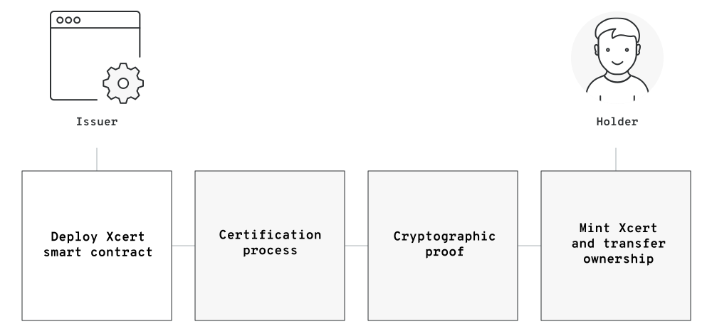
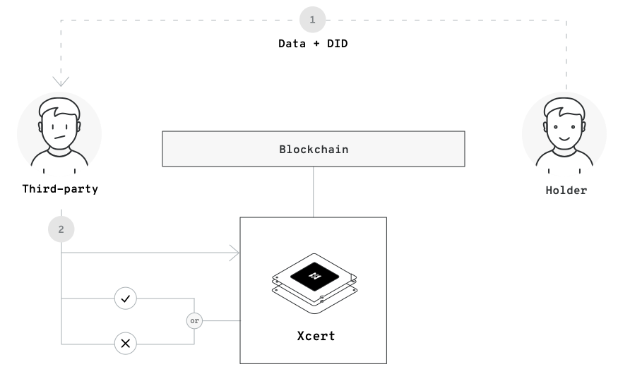

<h1 class="title">0xcert protocol</h1>
<div class="description">
  Open protocol for certified non-fungible tokens
</div>
<div class="info">
  Version 0.2<br/>
  Authors: Kristijan Sedlak, Jure Zih<br/>
  0xcert.org
</div>

<div class="pagebreak" />

# Abstract

0xcert is an open source, a permission-less protocol for certified non-fungible tokens on the blockchain. These tokens are stored in cryptographic wallets and are owned by users. In addition to common functions for transferring and managing standard non-fungible tokens, the 0xcert protocol provides another layer of conventions for creating certified non-fungible tokens for unique assets. These tokens are called Xcerts and are created through a custom minting process. Xcerts represent opinionated non-fungible tokens, which also hold an imprint of an asset. With 0xcert protocol, we can validate a proof of existence, authenticity, and ownership of these digital assets without third-party involvement.

0xcert is a framework with a set of on-chain and off-chain rules for managing Xcerts and other standard non-fungible tokens. Our mission is to equip application developers with a secure blockchain agnostic platform, powerful tools, and community embraced conventions for managing non-fungible tokens. 0xcert is a pluggable settlement with an advanced integration layer for different dapps and relay applications. This enables developers to focus on the application layer and quickly build applications for issuing university certificates, KYC applications, applications for loyalty programs, warranties, badges, credits or even a decentralized non-fungible exchange.

<div class="pagebreak" />

# Contents

<table class="contents">
  <tr class="contents__section">
    <td>1. Introduction</td>
    <td>01</td>
  </tr>
  <tr>
    <td>1.1. Overview</td>
    <td>01</td>
  </tr>
  <tr>
    <td>1.2. Fungibility</td>
    <td>03</td>
  </tr>
  <tr>
    <td>1.3. Decentralization</td>
    <td>03</td>
  </tr>
  <tr class="contents__section">
    <td>2. Specification</td>
    <td>05</td>
  </tr>
  <tr>
    <td>2.1. Xcert</td>
    <td>06</td>
  </tr>
  <tr>
    <td>2.1.1. Paradigm</td>
    <td>06</td>
  </tr>
  <tr>
    <td>2.1.2. Smart Contract</td>
    <td>06</td>
  </tr>
  <tr>
    <td>2.1.3. Asset Proof</td>
    <td>07</td>
  </tr>
  <tr>
    <td>2.1.4. On-chain Data</td>
    <td>07</td>
  </tr>
  <tr>
    <td>2.1.5. Off-chain Data</td>
    <td>08</td>
  </tr>
  <tr>
    <td>2.1.6. Minting</td>
    <td>08</td>
  </tr>
  <tr>
    <td>2.1.7. Decentralized Identifier (DID)</td>
    <td>09</td>
  </tr>
  <tr>
    <td>2.1.8. Burnable Xcert</td>
    <td>10</td>
  </tr>
  <tr>
    <td>2.1.9. Revokable Xcert</td>
    <td>10</td>
  </tr>
  <tr>
    <td>2.1.10. Pausable Xcert</td>
    <td>10</td>
  </tr>
  <tr>
    <td>2.2. Conventions</td>
    <td>11</td>
  </tr>
  <tr>
    <td>2.2.1. Paradigm</td>
    <td>11</td>
  </tr>
  <tr>
    <td>2.2.2. Asset Data</td>
    <td>12</td>
  </tr>
  <tr>
    <td>2.2.3. On-chain Data</td>
    <td>13</td>
  </tr>
  <tr>
    <td>2.2.4. Off-chain Data</td>
    <td>13</td>
  </tr>
  <tr>
    <td>2.2.5. Certification</td>
    <td>14</td>
  </tr>
  <tr>
    <td>2.2.6. Verification</td>
    <td>15</td>
  </tr>
  <tr class="contents__section">
    <td>3. Framework</td>
    <td>18</td>
  </tr>
  <tr>
    <td>3.1. Devkit (SDK)</td>
    <td>18</td>
  </tr>
  <tr>
    <td>3.2. Decentralized Exchange (DEX)</td>
    <td>19</td>
  </tr>
  <tr>
    <td>3.3. Decentralized Minter (DXM)</td>
    <td>20</td>
  </tr>
  <tr>
    <td>3.4. Continuous Integration</td>
    <td>21</td>
  </tr>


  <tr>
    <td>3.2. Protocol token (XCT)</td>
    <td>13</td>
  </tr>
  <tr>
    <td>3.3. Continuous integration</td>
    <td>13</td>
  </tr>
  <tr class="contents__section">
    <td>4. 0xcert explorer</td>
    <td>15</td>
  </tr>
  <tr class="contents__section">
    <td>5. References</td>
    <td>16</td>
  </tr>
</table>

<div class="pagebreak" />

# 1. Introduction

0xcert is an open source, a permission-less protocol for certified non-fungible tokens on the blockchain. These tokens are stored in cryptographic wallets and are owned by users. In addition to various common functions for transferring and managing standard non-fungible tokens, the 0xcert protocol provides an additional layer of conventions for creating certified non-fungible tokens from unique assets. These tokens are called Xcerts and are created through a custom minting process.

Xcerts represent standard non-fungible tokens, which also hold an imprint of an asset. With 0xcert protocol, we can further validate a proof of existence, authenticity, and ownership of these assets without third-party involvement.

The first implementation of the 0xcert protocol is focusing on the Ethereum blockchain. The 0xcert protocol tries to be blockchain agnostic, thus we would like to support other blockchains as well.

## 1.1. Overview

The blockchain is an amazing technology however, it is complex in its nature. Writing smart contracts is difficult and could be a very perilous task. This fact prevents many people from adopting the blockchain technology and building their decentralized applications on top of it.

Our mission is to equip application developers with a secure blockchain settlement, powerful tools and community embraced conventions for managing non-fungible tokens. 0xcert protocol extends the non-fungible paradigm with an opinionated certification layer for unique assets which is based on the 0xcert conventions. This allows for creating certified non-fungible tokens on the blockchain, which also carry an imprint of a unique real-world asset.

The protocol supports a wide range of use cases, where non-fungible assets and ownership play a role. Because the data are stored in decentralized blocks, the information can fully be trusted and verified by anyone and anywhere.

It provides a unified blockchain based certification layer for unique assets on the blockchain, which eliminates the need for a middleman between parties involved in the process.

The 0xcert protocol is an open-source project so anyone can use the fully functional 0xcert protocol with no limitations. Developers have the ability to manually mint, burn, verify and transfer Xcerts. The protocol uses a publicly accessible network of digital wallets and smart contracts on the blockchain, making it extensible through third-party modules and a variety of dapps.


*Figure 1: 0xcert protocol can act as an intermediary between parties.*

0xcert is an opinionated framework and supports numerous business models used by third-party dapps. These applications sit on top of the protocol and can use protocol tokens as a fuel for their service.

The dapps form a network of public and private certification services for unique assets and offer higher-level features that simplify and automate the certification process, provide public and private listings, rewarding mechanisms, integration gateways and more.

<div class="pagebreak" />

## 1.2. Fungibility

The most common tokens of today's crypto economy follow the Ethereum's ERC-20 specification. These tokens carry a price, which can be divided into smaller amounts. One can exchange just a portion of that price for a service or for different tokens. This is called fungibility, thus these are called fungible tokens.

Recently, another kind of token called non-fungible tokens started getting attention in the crypto community. Though we new non-fungible tokens before, it actually all started with Cryptokitties - tradable collectibles - which set the foundation for the now accepted ERC-721 standard. Unlike ERC-20 identical tokens, which carry a price, non-fungible tokens are unique and carry some sort of data.

The 0xcert protocol goes even further and introduces an Xcert as a certified, non-fungible token based on ERC-721 and 0xcert conventions, and it carries information about a particular unique asset. This mechanism is unique to the 0xcert protocol and is described in later sections.


## 1.3. Decentralization

Certification represents compliance with specific requirements. It can cover products and their components, services, people, and systems.

Digitalization of different assets has already introduced a new way of storing and sharing information online, making certification cheaper and more convenient for all involved parties. However, the ability to easily copy and share this data, also makes it vulnerable to various exploits, hacks, and falsifications. 

The protocol utilizes the blockchain, a distributed ledger technology that was first built to support the Bitcoin cryptocurrency. Blockchain can be best described as a distributed ledger that maintains a list of records called blocks. Each block has a timestamp and is built on top of an already existing block, preventing any data from being altered retroactively.


*Figure 2: 0xcert protocol uses blockchain to enable decentralization of unique assets.*

Blockchain offers a unique solution to the problem of secure online transactions. Due to its transparency and distribution of information to many decentralized blockchain nodes, it is nearly impossible to manipulate existing data records, making it potentially suitable for recording events, records, identities, certificates, transactions and other documentation.

Certification can benefit greatly from this new paradigm. By storing hashed data on the blockchain, individuals, companies, and institutions can keep a decentralized record of their certificate proofs, while maintaining sensitive data completely private. At the same time, all certified records, their issuers, and owners can be easily authenticated and referenced.

<div class="pagebreak" />

# 2. Specification

0xcert provides a framework with a set of on-chain and off-chain rules for managing Xcerts and other non-fungible tokens. In addition, the 0xcert protocol is a pluggable settlement with an advanced integration layer for different dapps and relay applications.


*Figure 3: Users can interact with the protocol manually or through higher-level dapps.*

Features of the 0xcert protocol are described in the technical specification documents which are publically available in the official 0xcert repository on GitHub. The documents are updated according to the dynamics of the 0xcert protocol development.

## 2.1. Xcert

An Xcert represents a one-of-a-kind asset in form of a non-fungible token on the blockchain. It holds a proof of a real-world asset and has all the properties of a non-fungible token.

### 2.1.1. Paradigma 

Digital assets on the blockchain as non-fungible tokens represent a new paradigm which enables application developers to build advanced and secure applications for managing real-world assets. Users hold asset ownership rights in their cryptographic wallets. They are able to exchange tokens between wallets and have control over the tokens they own.

The 0xcert protocol puts unique assets on the blockchain as non-fungible tokens. These tokens are called Xcerts and exist on the blockchain as an item of a specifically designed smart contract.

An Xcert is an item of a specifically designed smart contract which implements the non-fungible functionality. An Xcert is identified by an ID which is unique per Xcert smart contract and is always assigned to a cryptographic wallet. Besides the unique ID, a token can carry a proof of a digital asset, arbitrary on-chain data and a URI to additional off-chain data.

### 2.1.2. Smart Contract 

An Xcert smart contract is an extended non-fungible token smart contract. It follows the Ethereum’s ERC-721 specification which thus makes it compliant with the non-fungible token standard. 

An Xcert smart contract holds assets of a particular 0xcert convention. This makes the contract opinionated and forces predictable data.

A smart contract should always expose information about the used convention and smart contract interfaces and other capabilities. Following the Ethereum's ERC-165 standard to implement this features is considered a good practice.

### 2.1.3. Asset Proof

A very important and a unique part of an Xcert is a cryptographic proof which is stored in token itself.

An Xcert can thus carry an imprint of a unique real-world asset. The proof is the result of the 0xcert certification process which is described later in this document. It represents a cryptographic hash build from asset data and serves as a decentralized proof of an asset on the blockchain.

An Xcert does not include actual asset data, only the proof of it. This ensures data confidentiality because no information is disclosed to the general public and the actual content is always kept private to the involved parties only.

This concept makes the 0xcert protocol unique and extends the usability to a whole new level. 


*Figure 4: An Xcert is a non-fungible token that carries asset proof.*

### 2.1.4. On-chain Data

We can attach additional public data to each Xcert. The parameters which are attached directly on the token itself usually participate in atomic swaps or other on-chain operations. 

<div class="pagebreak" />

### 2.1.5. Off-chain Data

Storing data on the blockchain could be expensive. Sometimes we would want to provide also dynamic data about a particular Xcert. Managing data directly on the blockchain would not scale. By exposing additional information about a token as an off-chain data file solves many problems and makes the system flexible and scalable.

Each Xcert includes a URI to a publicly available metadata file. This data object is a specifically designed JSON object, which conforms to RFC-7159 and follows the mapping format defined by the JSON Schema specification.

The naming of JSON properties should follow the schema.org dictionary when possible. This is to enable an easy way to convert a data into a JSON-LD format. The convention also expects the JSON keys to be defined in alphabetical order.

A metadata file should be served through a secure HTTPS connection on the public web. The response returns data in "application/schema+json" content type. It also includes a Link header pointing to JSON Schema definition file of the received metadata object. The JSON Schema definition varies based on the token capabilities and the asset it represents.

Off-chain metadata JSON files are not mandatory but are highly recommended. We also recommend storing these files in the decentralized system instead of hosting them by a company itself. 

### 2.1.6. Minting

The process of issuing new Xcerts is called "minting". This is enabled by the Xcert smart contract deployed on the blockchain.

The minting process creates a new unique Xcert for a particular asset and assigns it to a digital wallet. A new Xcert can be minted by the issuer, who owns the Xcert smart contract or by an entity authorized by the issuer. 

Anyone can become an issuer by deploying a new Xcert smart contract to the blockchain. An issuer should represent a trusted authority that provides value for the interested public. The issuer uses Xcerts on the blockchain to provide proofs of ownership for its digitized assets.

The minting process starts by asset certification process which is covered later in this document. The result of the certification is asset data objects and a cryptographic proof of a digital asset. An issuer submits these content, together with additional protocol configuration and holder address to the blockchain which creates a new Xcert token and assigns the ownership to the provided holder. Optionally an issuer publishes the public metadata as well.



*Figure 5: The mingin process creates a new Xcert on the blockchain.*

In terms of a trust, the issuer is responsible to prove and promote their account authenticity information over arbitrary communication media when needed.

### 2.1.7. Decentralized Identifier (DID)

A decentralized identifier uniquely identifies an Xcert. A decentralized identifier or simply a DID is a string format which uniquely identifies an Xcert on the blockchain.

An Xcert identification consists of multiple pieces of information. The 0xcert protocol uses DIDs to uniquely describe an asset on the blockchain as a URI that can be resolved as a publicly available resource.

All DIDs are defined as "did:xcert:{URI}". The URI consists of multiple information joined with "/" following the sequence:

| Index | Include | Description
|-|-|-
| 0 | Always | Blockchain identifier (e.g. "ethereum").
| 1 | Always | Xcert smart contract address.
| 2 | Always | Xcert token ID.

### 2.1.8. Burnable Tokens

Some digital assets can become invalid over time. By making Xcerts burnable, a user can clean up his/her wallet by permanently removing these tokens. An issuer can enable users to burn the Xcert tokens they own. When a user burns a token it permanently removes it from his/her wallet and thus from the Xcert smart contract.

### 2.1.9. Revokable Xcert

Sometimes an issuer requires more control over tokens management. By making Xcerts revokable the issuer can remove the token at any time. A user, in that case, has no control. This functionality is sometimes needed but it is not recommended. An issuer should always provide a good explanation for including this feature in the Xcert smart contract.

### 2.1.10. Pausable Xcert

Issuers can make Xcert smart contract pausable. This means that an issuer has the ability to pause and resume Xcert transfers. This feature is especially useful when migrating or upgrading issuer's local database. 

<div class="pagebreak" />

## 2.2. Conventions

To simplify the process of describing assets as data objects and to enable interoperability between different applications 0xcert provides conventions for creating digital assets.

### 2.2.1. Paradigm

A digital asset is a data object which holds information about a real-world asset. 0xcert uses blockchain to store a cryptographic proof of a particular asset in form of a non-fungible token. The protocol provides conventions for defining these data objects and rules for converting them into Xcert tokens on the blockchain.


*Figure 6: Asset data are defined by a convention.*

A digital asset in the 0xcert protocol is defined and described in the form of specifically designed JSON objects, which conform to RFC-7159 and follow the mapping format defined by the JSON Schema specification.

Every digital asset in the 0xcert protocol has its own JSON Schema definition for describing the asset, on-chain properties, and off-chain metadata. The schemas represent a technical specification of a particular digital asset, which explains the JSON data object structure.

The naming of JSON properties follows the schema.org dictionary when possible. This enables an easy way to convert data object into a JSON-LD format. The convention also expects the JSON keys to be defined in alphabetical order.

Schema documents are defined and approved by the interested community engaging the protocol. The community can propose updates and new conventions, which can then be included in the protocol, based on the majority consensus.

### 2.2.2. Asset Data

The main convention file is a JSON Schema which describes a data structure of a digital asset. These data are usually considered private and the content is known only to the issuer and token owner.

This data structure is used for creating a cryptographic proof for a digital asset which is carried by the Xcert token.

The 0xcert protocol can cover all sorts of digital assets. A simple imaginary schema, that describes a person, could look something like this:

```json
{
  "$schema": "http://json-schema.org/draft-07/schema#",
  "description": "A person (alive or fictional).",
  "properties": {
    "name": {
      "descripton": "A full name of a Person.",
      "type": "string"
    }
  },
  "required": ["name"],
  "title": "Person",
  "type": "object"
}
```

*Figure 7: Xcert schemas describe digital assets in a way that machines can understand.*

### 2.2.3. On-chain Data

Some assets need additional parameters stored directly on the Xcert. This data are usually used by the blockchain mechanics like atomic swaps where a transaction can be performed only under certain conditions. 

### 2.2.4. Off-chain Data

Optionally an asset can also provide dynamic metadata on some public URI. These data provide additional information about an asset, should be publically accessible to anyone can, and can change over time.

Every Xcert should have at least the basic metadata JSON Schema definition like this:

```json
{
  "$schema": "http://json-schema.org/draft-07/schema#",
  "description": "An Xcert metadata object.",
  "properties": {
    "description": {
      "type": "string",
      "description": "A description of an asset.",
    },
    "image": {
      "format": "uri",
      "type": "string",
      "description": "An URI to the resource with mime type image/*. Consider making any images at a width between 320 and 1080 pixels and aspect ratio between 1.91:1 and 4:5 inclusive."
    },
    "name": {
      "description": "A unique name of an asset.",
      "type": "string",
    }
  },    
  "title": "Xcert",
  "type": "object"
}
```

*Figure 8: Metadata follow the JSON format of the ERC-721 standard.*

### 2.2.5. Certification

An Xcert carries a proof of a digital asset data. It is a cryptographic hash which serves as a decentralized proof of a digital asset on the blockchain. The process of converting digital asset data into a cryptographic proof is called "certification". Tokens that hold these cryptographic proofs are thus called certified tokens.

The 0xcert protocol provides a mechanism for converting the main data object into a cryptographic hash. The mechanism first flattens the JSON structure and sorts data parts by JSON keys. Values are then hashed into Merkle tree leafs using the sha256 algorithm and finally calculated into Merkle tree root hash which represents the actual asset proof which we store in the Xcert.

The certification process starts by creating asset data objects. The main data object is then converted into a cryptographic proof. When the certification is completed, the issuer sends the main JSON data object over an arbitrary communication medium to the holder, so he will be able to provide the proof of ownership for the particular digital asset.

All parties involved in the certification process are expected to keep a copy of the JSON data object, in the same way as they keep a copy of their digital wallet credentials. They can store this information locally or can authorize third-party dapps to do that on their behalf.

### 2.2.6. Verification

A cryptographic proof is an imprint of an asset which at the same time ensures asset data confidentiality. This proof is used to verify the existence and authenticity of a digital asset.

The 0xcert protocol allows for trustless verification of any kind of digital asset existence and related ownership. Anyone is able to verify some information based on digital asset imprint - the cryptographic proof - stored inside Xcerts on the blockchain.

In order to obtain valid information about a particular digital asset, a holder must disclose asset information to a third-party. If the proof is created by using the 0xcert protocol's mechanism, then not all the data are required in the verification process and a third-party can selectively verify only some asset fields. For this to work, a holder must provide enough information for the third-party to be able to recalculate Merkle tree root hash from the provided visible and hashed leafs. When the recalculated hash equals to the one stored in the Xcert the information can be treated as valid and the holder can be trusted. A holder must also provide the appropriate Xcert smart contract address on the blockchain, where the digital asset exists.



*Figure 9: Xcerts carry a trustless proof of digital asset existence and ownership.*

In terms of dapps, the verification process is usually automated. Some dapps might expect a holder to have the Xcert stored in his digital wallet. Holders are able to have all Xcerts stored in their digital wallets and share the proof of ownership with anyone at will. This enables a third-party to quickly and easily verify any provided information without unnecessary interaction.

<div class="pagebreak" />

# 3. Framework

The 0xcert framework consists of multiple parts which enable application developers to build secure decentralized applications with the support for custom business models. The 0xcert protocol is an opinionated all-in-one framework. It is blockchain agnostic, provides conventions, and includes powerful tools for building decentralized non-fungible applications.

In addition to the raw protocol logic, the 0xcert framework includes libraries and a set of smart contracts already installed on the blockchain. The 0xcert framework is a pluggable settlement with an advanced integration layer for different dapps and relay applications. 


*Figure 10: Dapps on top of the 0xcert protocol form a network of interoperable non-fungible services.*

## 3.1. Devkit (SDK)

The framework tries to hide away the complex blockchain layer thus wraps the 0xcert protocol features into an easy to use SDK. This empowers developers with powerful decentralized tools that developers can use as a standard API library. 

The 0xcert protocol can thus be easily integrated into existing systems. Applications don't have to struggle with the low-level blockchain complexity and can thus immediately start using a solid, secure and flexible non-fungible infrastructure that ensures interoperability between dapps by default.

## 3.2. Decentralized Exchange (DEX)

DEX is one of the key supporting components in the 0xcert framework. DEX represents a set of smart contracts installed on the blockchain which allow for a trustless exchange of multiple different types of fungible and non-fungible tokens as single atomic operations.

DEX consists of multiple contracts. To make it upgrade-able the smart contracts communicate through proxy smart contracts. This way we can upgrade the core DEX contracts while data stay untouched. 

A proxy is best explained as a smart contract that allows or rejects access to some key functionality and is controlled by a multisig wallet or a DAO. This way proxies can be trusted since they only allow access to smart contracts that were approved through the DAO process.

The DEX process of exchanging tokens has several steps:
* Parties come to an off-chain agreement that party A will exchange fungible and non-fungible tokens with party B.
* Party A creates claims (blockchain signed messages) of the agreed data then sends these data together with claims to party B.
* Party A allows the proxies to transfer tokens on his/her behalf.
* Party B also allows the proxies to transfer tokens on his/her behalf.
* Party B submits the agreed data with claims to the swapper smart contract.
* The swapper performs an atomic operation which exchanges the tokens.

If any step of the process is not correct the swapper will not perform the operation. So if party B tries to change the data in a way that he/she would transfer less or different tokens the operation would fail because the claims would not match with the data party B provided.

## 3.3. Decentralized Minter (DXM)

DXM is another important component of the 0xcert framework. It allows for the trustless minting of Xcert tokens directly to recipients.

The DXM can mint and exchange Xcert tokens for other fungible and non-fungible tokens in a single atomic. It also enables an issuer to delegate the mint execution and payment of blockchain fees to the recipient.

DXM consists of multiple contracts. To make it upgrade-able the smart contracts communicate through proxy smart contracts. This way we can upgrade the core DXM contracts while data stay untouched.

The minting of Xcert tokens using DXM is performed in multiple steps:
* Parties come to an off-chain agreement that the issuer will mint a specific Xcert for the recipient in exchange for some tokens.
* The issuer creates claims (blockchain signed messages) of the agreed data then sends these data together with claims to the participant.
* The issuer allows the proxies to mint the Xcert token on his/her behalf.
* The recipient allows the proxies to transfer tokens on his/her behalf.
* The recipient submits the agreed data with claims to the minter smart contract.
* The minter performs an atomic operation which creates a new Xcert token and transfers recipient tokens to the issuer.

If any step of the process is not correct the minter will not perform the operation. So if the recipient tries to change the data in a way that he/she would transfer fewer tokens the operation would fail because the issuer's blockchain signature would not match with the data the recipient provided. If the issuer or the recipient would not allow proxies to operate on their behalf the operation would also fail.

## 3.4. Continuous Integration

A smart contract cannot be changed after it is deployed to the blockchain. Changes can be applied only by deploying a new contract at a new address.

The protocol may include a decentralized governance (DAO) mechanism to allow the community to vote for improvements and possibly fork the protocol into multiple versions. The contracts may use protocol tokens to securely drive a decentralized continuous integration of updates with no disruption, while also protecting all the parties and stakeholders.

<div class="pagebreak" />

## 4. Protocol token (ZXC)

According to William Mougayar, author of "The business blockchain", a token is "a unit of value that an organization creates to self-govern its business model, and empower its users to interact with its products while facilitating the distribution and sharing of rewards and benefits to all of its stakeholders."

The ZXC tokens are the native utility tokens of the 0xcert protocol. These are fungible tokens and are compliant with the Ethereum's ERC-20 standard.


*Figure 11: ZXC token is a native utility token of the 0xcert protocol.*

The ZXC token is a protocol token and is introduced to align certification parties with dapps and the community. With the infrastructure built around a system of smart contracts, its primary role is to provide the incentive mechanisms and to support the ecosystem with minimum possible fees. ZXC is the basic liquid asset for dapps that operate on the protocol. Similar to gas on the Ethereum blockchain the protocol token may play a role in all sorts of protocol activities.

Over time a decentralized governance may be introduced to further strengthen the 0xcert community. The protocol token may play a key role when creating a decentralized autonomous organization. The protocol token may not only be used as a rewarding mechanism but also as a distributed voting mechanism.

The 0xcert ecosystem may soon introduce issuer verification registry (IVR). It would be a form of a token curated registry proposed by Mike Goldin. The registry would list all issuers verified by the community. In the future, one of the fundamental problems in the blockchain space may become the authenticity of issuers. At the moment there is no strong incentive that would award fairness and honesty in the blockchain space. A self-sustaining verification registry which would use staking and rewarding mechanisms based on the 0xcert protocol token seems like a good solution. Other solutions may be introduced in the future in order to protect our users and the 0xcert community reputation. 

<div class="pagebreak" />

# 5. 0xcert Labs

The 0xcert team is determined to continuously bring value to the open-source community. Our mission is to empower developers with powerful tools and useful non-fungible applications.

We believe that we can only understand developers, the blockchain and decentralization if we actually use the protocol and build on top of it. We formed the 0xcert Labs as the 0xcert discovery group which will work on the latest innovations in the space of nonfungibility, decentralization and the blockchain. 

In addition to the 0xcert protocol development, the purpose of the 0xcert team, as the core team behind the 0xcert protocol, is to provide a foundation for trustless, certified, non-fungible tokens on the blockchain and to manage and unify the community by connecting individuals and groups working in the area of non-fungibility or certification, and to provide resources and support for the related community driven incentives.

## 5.1. ERC-721 Implementation

We already successfully completed the complete implementation of the ERC-721 non-fungible token standard for the Ethereum blockchain. 

The purpose of this implementation is to provide a good starting point for anyone who wants to use and develop non-fungible tokens on the Ethereum blockchain. Instead of re-implementing ERC-721, developers will use this code which has gone through multiple audits and we hope it will be extensively used by the community in the future.

## 5.1. 0xcert Scanner

The 0xcert team provides and manages an online 0xcert Scanner dapp. It enables a live view of the 0xcert network. This represents the central hub for non-fungible tokens on the blockchain.

## 5.2. 0xcert Identity

The 0xcert team will soon do the showcase of identities as non-fungible tokens on the blockchain. This will be our first big use case which will show the community the enormous potential of this new technology.

## 5.3. 0xcert DEX

The 0xcert team is already working on a decentralized application on top of the 0xcert protocol for exchanging fungible and non-fungible tokens.

## 5.4. 0xcert DXM

The 0xcert team is already working on the first all-in-one decentralized application on top of the 0xcert protocol for minting Xcert and other non-fungible tokens.

<div class="pagebreak" />

# 6. References

<div class="left">

Non-fungible Token Standard,<br/>https://github.com/ethereum/EIPs/blob/master/EIPS/eip-721.md

Decentralized Identifiers (DIDs),<br/>https://w3c-ccg.github.io/did-spec/

Cryptographic hash function,<br/>https://en.wikipedia.org/wiki/Cryptographic_hash_function

Cryptocurrency wallet,<br/>https://en.wikipedia.org/wiki/Cryptocurrency_wallet

Metadata,<br/>https://en.wikipedia.org/wiki/Metadata

GDPR,<br/>https://www.eugdpr.org/

JSON RFC-7159,<br/>https://en.wikipedia.org/wiki/JSON

Digital asset,<br/>https://en.wikipedia.org/wiki/Digital_asset

JSON Schema,<br/>http://json-schema.org

JSON-LD,<br/>https://json-ld.org/

HTTPS protocol,<br/>https://en.wikipedia.org/wiki/HTTPS

Link header,<br/>https://www.w3.org/wiki/LinkHeader

ERC-721 Standard,<br/>https://github.com/ethereum/EIPs/blob/master/EIPS/eip-721.md

ERC-721 Implementation,<br/>https://github.com/0xcert/ethereum-erc721

What is ERC-721,<br/>http://erc721.org/

</div>