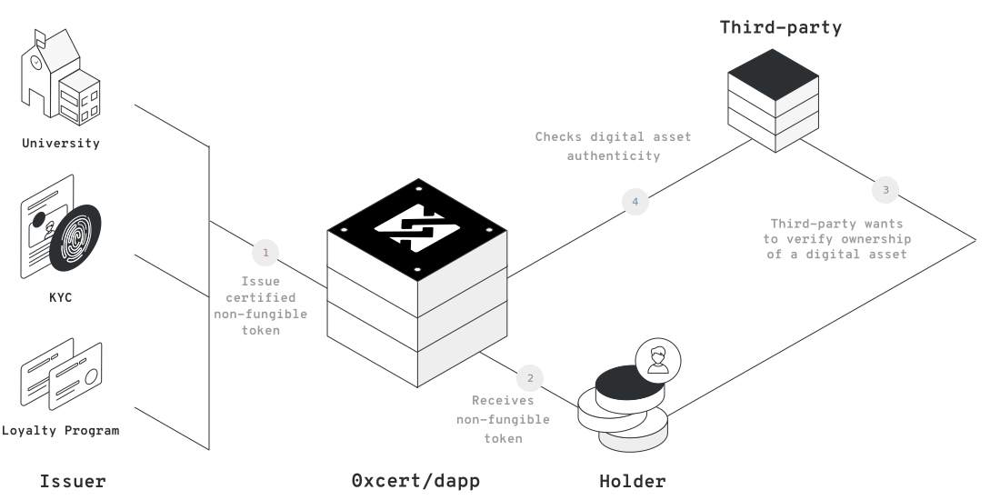
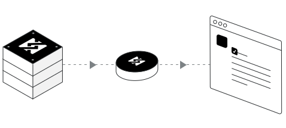
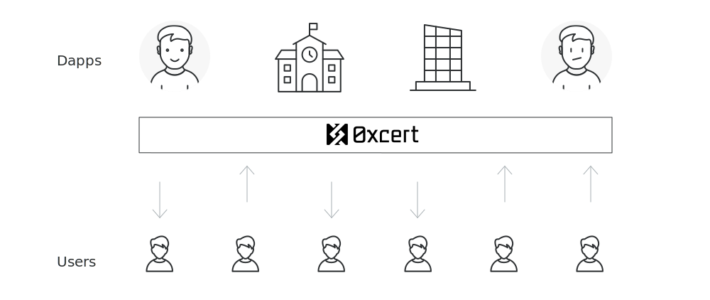
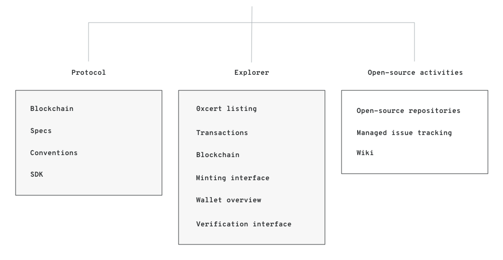

<h1 class="title">0xcert protocol</h1>
<div class="description">
  Open protocol for decentralized certificates as non-fungible digital assets
</div>
<div class="info">
  Version 0.7<br/>
  Authors: Kristijan Sedlak, Jure Zih<br/>
  0xcert.org
</div>

<div class="pagebreak" />

# Abstract

0xcert is an open source, permissionless protocol for validating existance, authenticity and ownership of digital assets on the blockchain called xcerts. It acts as a mediator between parties involved in the certification process. 0xcert is a framework with a set of on-chain and off-chain rules for managing xcerts. It's a pluggable settlement with an advanced integration layer for different dapps and relay applications. 0xcert also provides and manages an online 0xcert Explorer dapp, which enables a live view of the 0xcert network, together with interfaces for interacting with the protocol.

<div class="pagebreak" />

# Contents

<table class="contents">
  <tr class="contents__section">
    <td>1. Introduction</td>
    <td>01</td>
  </tr>
  <tr>
    <td>1.1. Overview</td>
    <td>01</td>
  </tr>
  <tr>
    <td>1.2. Decentralization</td>
    <td>02</td>
  </tr>
  <tr class="contents__section">
    <td>2. Specification</td>
    <td>04</td>
  </tr>
  <tr>
    <td>2.1. Smart certificate</td>
    <td>05</td>
  </tr>
  <tr>
    <td>2.2. Conventions</td>
    <td>06</td>
  </tr>
  <tr>
    <td>2.3. Certification</td>
    <td>07</td>
  </tr>
  <tr>
    <td>2.4. Verification</td>
    <td>09</td>
  </tr>
  <tr class="contents__section">
    <td>3. Business layer</td>
    <td>11</td>
  </tr>
  <tr>
    <td>3.1. Third-party services</td>
    <td>11</td>
  </tr>
  <tr>
    <td>3.2. Protocol token (XCT)</td>
    <td>12</td>
  </tr>
  <tr>
    <td>3.3. Continuous integration</td>
    <td>12</td>
  </tr>
  <tr class="contents__section">
    <td>4. 0xcert explorer</td>
    <td>14</td>
  </tr>
  <tr class="contents__section">
    <td>5. References</td>
    <td>15</td>
  </tr>
</table>

<div class="pagebreak" />

# 1. Introduction

0xcert is an open protocol for decentralized certificates as non-fungible digital assets on the blockchain. The protocol allows for validating a proof of existence, authenticity and ownership of any digital asset, based on digital cryptographic wallets and smart certificates called xcerts.

## 1.1 Overview

The protocol supports a wide range of use cases, where digital assets and ownerships play a role. Because the data are stored in decentralized blocks, the information can fully be trusted and verified by anyone and anywhere.



*Figure 1: 0xcert protocol acts as an intermediary between issuers, holders and sceptics.*

It provides a unified blockchain based certification layer for digital assets, which eliminates the middleman and acts as a mediator between parties involved in the certification process. Anyone can use the fully functional 0xcert protocol completely free of charge, with the ability to manually mint, burn, verify and transfer xcerts. In addition, the protocol uses a publicly accessible network of digital wallets and smart contracts, making it extensible through third party modules and a variety of dapps on a shared infrastructure.

0xcert is unopinionated and supports numerous business models, used by third-party dapps. These applications sit on top of the protocol and can use XCT tokens as a fuel for their services. The dapps form a network of public and private digital assets certification services and offer higher-level features, that simplify and automate the certification process, provide public and private listings, rewarding mechanisms, integration gateways and more.

## 1.2 Decentralization

Certification represents compliance with specific requirements accredited by an independent body of conformity. It covers products and their components, services, people and systems.


*Figure 2: 0xcert protocol uses blockchain to store imprints of digital assets.*

Digitalization of different assets has already introduced a new way of storing and sharing information online, making certification cheaper and more convenient for all involved parties. However, the ability to easily copy and share this data, also makes it vulnerable for various exploits, hacks and falsifications. 

The protocol is built with the use of blockchain, a distributed ledger technology that was first built to support the Bitcoin cryptocurrency. Blockchain can be best described as a distributed ledger that maintains a list of records called blocks. Each block has a timestamp and is built on top of an already existing block, preventing any data to be altered retroactively.

Blockchain offers a unique solution to the problem of secure online transactions. Due to its transparency and distribution of information to many decentralized blockchain nodes, it is nearly impossible to manipulate existing data records, making it potentially suitable for recording events, records, identities, certificates, transactions and other documentation.

Certification can benefit greatly from this new paradigm. By storing hashed data on the blockchain, individuals, companies and institutions can keep a decentralized record of their certificate proofs, while maintaining sensitive data completely private. At the same time, each certificate record, their issuers and owners, can be easily authenticated and referenced.

<div class="pagebreak" />

# 2. Specification

0xcert provides a framework with a set of on-chain and off-chain rules for managing xcerts as well as an advanced integration layer for different dapps and relay applications.


*Figure 3: Users can interact with the protocol manually or through higher-level dapps.*

## 2.1. Smart certificate

A cryptographic token is a unit of value that an organization creates to self-govern its business model. It empowers its users to interact with its products, while facilitating the distribution and sharing of rewards and benefits to all of its stakeholders.

It can represent a multitude of digital assets that functionally range from payment units, governance instruments, ownership rights, to benefits sharing and voting power. With frictionless trust, enabled by the blockchain technology, a token can also act as a verifiable proof of achievements and accomplishments or in other words, a certificate.

A certificate in the 0xcert protocol is called “xcert“. It represents an imprint of a digital asset which serves as a decentralized proof of a digital asset on the blockchain. 

Similar to well known ERC-20 tokens, the xcert, is a specially designed smart contract, also referred to as a smart certificate, which follows the Ethereum’s ERC-721 specification, also known as non-fungible tokens or a deed standard.



*Figure 4: Xcerts are non-fungible digital assets that carry distinguishable data.*

Each xcert within the smart certificate is unique and is identified by a digital asset imprint. The imprint itself is a cryptographic hash representation of a digital asset.

An xcert does not include any actual asset data, only the proof of it. This ensure data confidentiality, because no information is disclosed to the general public and the actual content is always kept private to the involved parties only.

The xcert design also follows the W3C specification that covers decentralized identifiers, also known as DIDs and thus expects an URL, which points to the xcert document with digital asset imprint details. 

```json
{
  "@context": "https://w3id.org/did/v1",
  "id": "did:{convention-id}:{token-id}",
  "proofAlgorithm": "{imprint-algorithm}",
  "proofValue": "{imprint-hash}",
  "name": "Cambridge University Certificate"
}
```

*Figure 5: Xcert document is a JSON file with imprint details.*

The xcert document is a single JSON object conforming to RFC-7159 and follows the mapping format defined by the JSON-LD specification. A minimum object should include subject information, asset proof data and a localized name of an asset. 

## 2.2. Conventions

A digital asset in the 0xcert protocol is defined and described in form of a specifically designed JSON object, which conforms to RFC-7159 and follows the mapping format defined by the JSON-LD specification.

The protocol provides conventions for these objects, thus every digital asset in the 0xcert protocol has its own xcert recipe. The xcert recipe represents a technical specification of a particular digital asset, which explains the JSON object structure and a detailed description of each data key. These documents are defined and approved by the interested community around the protocol. The community can propose updates and new conventions, which can then be included into the protocol, based on the majority consensus.

The 0xcert protocol can cover all sorts of digital assets. A simple imaginary xcert recipe, that describes a person, could look something like this:

```json
{
  "@context": "http://schema.org",
  "@type": "Person",
  "name": "John Smith"
}
```

*Figure 6: Xcert recipes describe digital assets in a way that machines can understand.*

## 2.3. Certification

Xcerts are assigned to digital wallets. The ownership of each xcert is transferable between digital wallets. 


*Figure 7: Xcerts hold information about different digital assets and ownerships.*

New xcerts can be minted by the issuer, which owns the xcert smart contract or by an entity authorized by the issuer. Similar logic applies to the burning process, where  the holder is also allowed to burn any xcert that he owns. 

The manual certification flow is carried out in multiple steps, usually between an issuer and a holder.

An issuer represents a trusted authority that provides a value for the interested public. The issuer uses xcerts on the blockchain to provide a proof of ownership for its digitized assets.

The issuer creates a new smart certificate and deploys it to the public blockchain. This makes the issuer also the owner of this smart contract, with ability to mint new xcerts and transfer ownerships to holders.


*Figure 8: An issuer enables certification by deploying the xcert smart contract to the blockchain.*

The minting process of a new xcert starts by creating a certificate recipe. As explained earlier in the document, this object holds information about a particular digital asset and can include product related data, issuer details, holder identity information and more. The protocol provides this kind of convention for each digital asset, and specifies a list of required and optional keys, related type information and usage details. 

When the certificate recipe object is created, issuer converts it into a cryptographic hash, which is an imprint of a digital asset and represents a proof. The protocol allows different cryptographic algorithms to be used and it is up to the issuer to decide the appropriate level of security. 

For the final step in the certification process, the issuer submits the cryptographic hash, together with holder’s wallet address to the xcert smart contract on the blockchain. 

The minting process creates a new xcert and assigns the ownership to the provided holder. When the certification is completed, the issuer sends the recipe object over arbitrary communication medium to the holder, so he will be able to provide the proof of ownership for the particular digital asset. 

All parties involved in the certification process are expected to keep a copy of the xcert recipe object, in the same way as they keep a copy of their digital wallet credentials. They can store this information locally or can authorize third-party dapps to do that on their behalf.

In terms of trust, issuer is responsible to prove and promote their account authenticity information over arbitrary communication medium when needed.

## 2.4. Verification

0xcert protocol allows for trustless verification of any kind of digital asset existence and related ownerships. Anyone is able to verify some information based on digital asset imprint - the cryptographic proof - stored inside xcerts on the blockchain.

In order to obtain valid information about a particular digital asset, a holder must disclose information to skeptical party, and send a certification recipe for the requested asset, through an arbitrary communication medium. A holder must also provide the appropriate xcert smart contract address on the blockchain, where the digital asset imprint exists and can thus be verified.

Based on the data, received from a holder, the party creates a cryptographic hash from the provided certification recipe object and then verifies that it matches with the one stored in the provided xcert on the blockchain. When the hash strings are equal the information can be treated as valid and the holder can be trusted.


*Figure 9: Xcerts carry a trustless proof of digital asset existence and ownership.*

In terms of dapps, the verification process is usually automated. Some dapps might expect a holder to have the xcert stored in his digital wallet. Holders are able to have all xcerts stored in their digital wallets and share the proof of ownership with anyone at will. This enables third party to quickly and easily verify any provided information without unnecessary interaction.

<div class="pagebreak" />

# 3. Business layer

The 0xcert protocol represents a low-level certification layer and defines the steps for different certification flows, strengthened by the conventions. The protocol allows for building a higher-level applications and services, to enable advanced certification features, usage simplifications and automatization.

## 3.1. Third-party services

In addition to the raw protocol, 0xcert provides a set of smart contracts installed on the blockchain, with supporting SDKs, which cover different business models. This allows easy integration of the 0xcert protocol into existing systems.

Relay applications and other dapps don't have to struggle with the low-level blockchain complexity and can thus immediately start using a solid and flexible certification infrastructure that ensures interoperability between dapps by default.



*Figure 10: Applications on top of the 0xcert protocol form a network of certification services.*

This setup supports common business logic and serves as a decentralized proxy for handling communication between services and certification parties. Applications can use protocol’s XCT token, for payments or as a fuel for their services.

## 3.2. Protocol token (XCT)

XCT tokens are the native utility tokens of the 0xcert protocol. They are compliant with the ERC-20 standard contract ABI for tokens on the Ethereum blockchain.


*Figure 11: XCT tokens are native ERC-20 utility tokens and are used for paying fees.*

XCT represents a protocol token and is introduced to align certification parties with dapps and assures that the proposed protocol can be adhered to.

With the infrastructure built around a system of smart contracts and dapps, its primary role is to provide the incentive mechanisms and support the ecosystem with minimum possible fees. XCT is the basic liquid asset for dapps that operate on the protocol, and similar to gas on the Ethereum blockchain, covers fees for issuing and verifying xcerts.

## 3.3. Continuous integration

A smart contract cannot be changed after it is deployed to the blockchain. Changes can be applied only by deploying a new contract at a new address.

Protocol may include a decentralized governance (DAO) mechanism to allow the community to vote for improvements and possibly fork the protocol into multiple versions. The contracts may use protocol tokens to securely drive a decentralized continuous integration of updates with no disruption, while also protecting all the parties and stakeholders.

<div class="pagebreak" />

# 4. 0xcert explorer

The purpose of the 0xcert foundation, as an institution behind the 0xcert protocol, is to provide the foundation for the trustless certificates on the blockchain and to unify the certification space as much as possible. The foundation tends to bring the value to the open-source community around the 0xcert protocol, to connect individuals and groups working in the area of certification and to provide resources and support for the related community driven incentives.

In addition to the protocol itself, the 0xcert foundation provides and manages an online 0xcert Explorer dapp, which enables a live view of the 0xcert network, together with interfaces for interacting with the protocol and represents the central certification hub.



*Figure 12: 0xcert Explorer is an open-source dapp, which includes a block explorer, search, API interfaces and analytics for decentralized xcerts on the blockchain.*

<div class="pagebreak" />

# 5. References

[*] Deed Standard, https://goo.gl/kh5qaS

[*] Non-fungible Token Standard, https://goo.gl/xAzeAi

[*] Decentralized Identifiers (DIDs), https://goo.gl/8MYACk

[*] JSON for Linking Data, https://goo.gl/KogugR

[*] Structured Data, https://goo.gl/kAzGS1

[*] JSON-LD Best Practices, https://goo.gl/P8NhrF

[*] JSON-LD JavaScript implementation, https://goo.gl/HgEYJE

[*] JavaScript Object Notation or JSON, https://goo.gl/S3j1fV

[*] 0x project, https://0xproject.com

[*] Blockcerts, https://www.blockcerts.org

[*] Open Badges, https://goo.gl/FDKJmC

[*] MIT Media Lab Digital Certificates, https://goo.gl/aWHn7R
